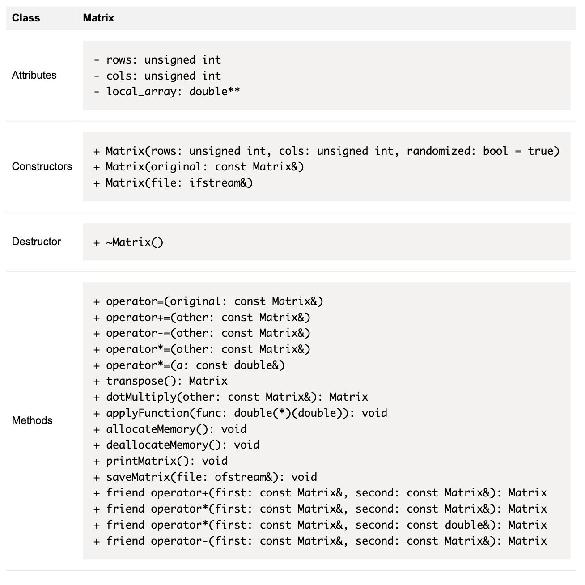
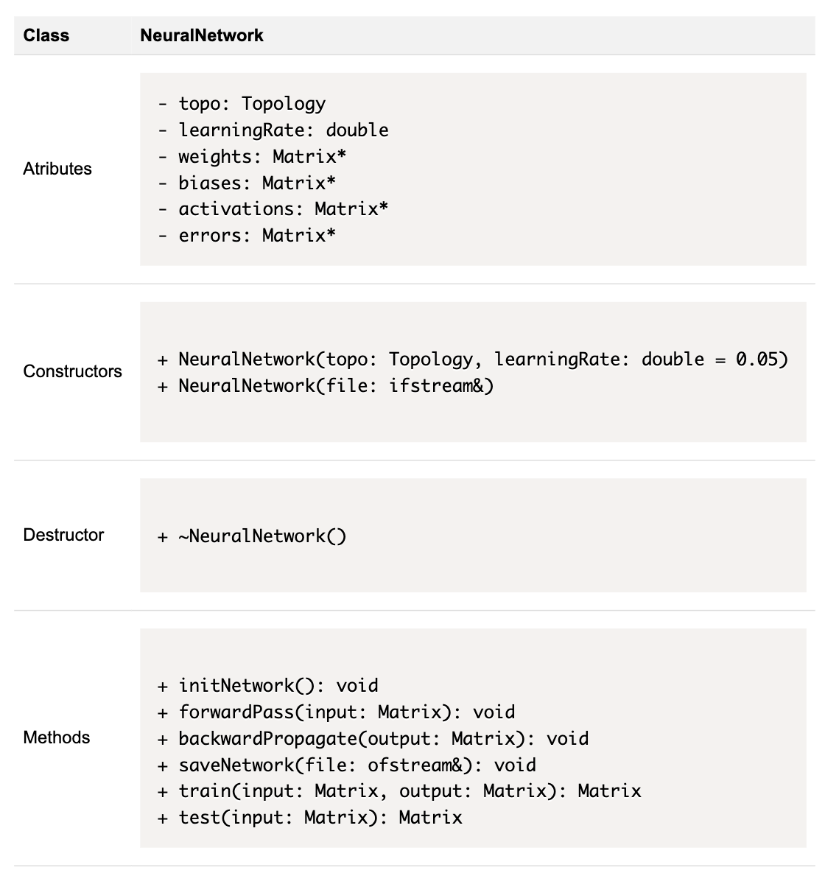
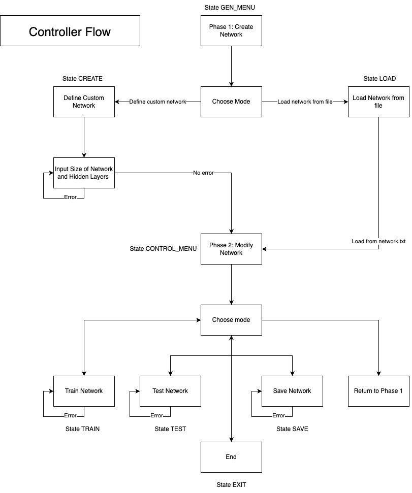
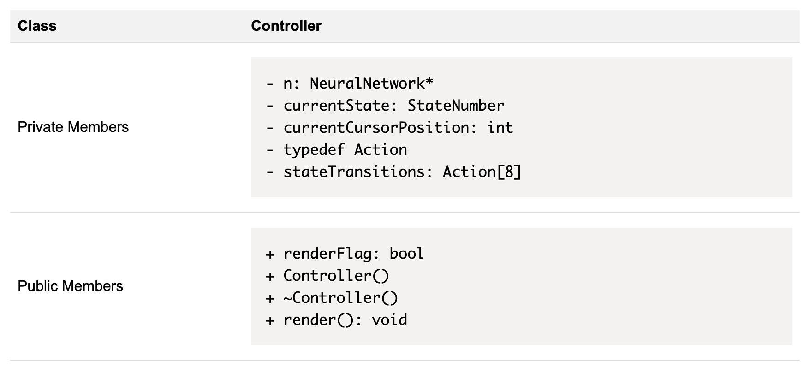
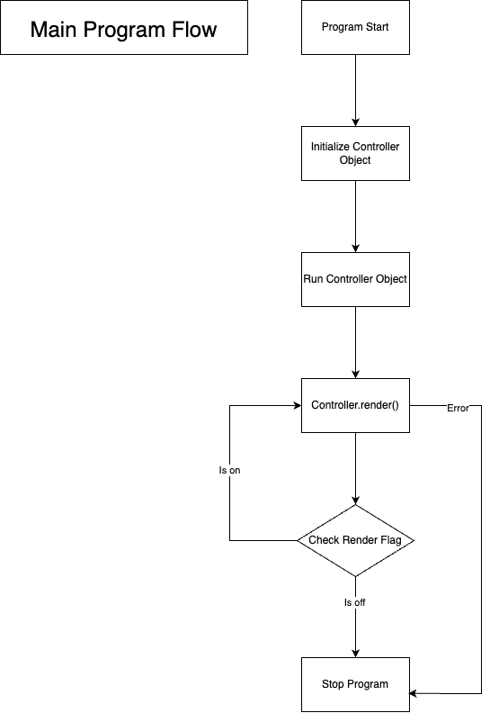
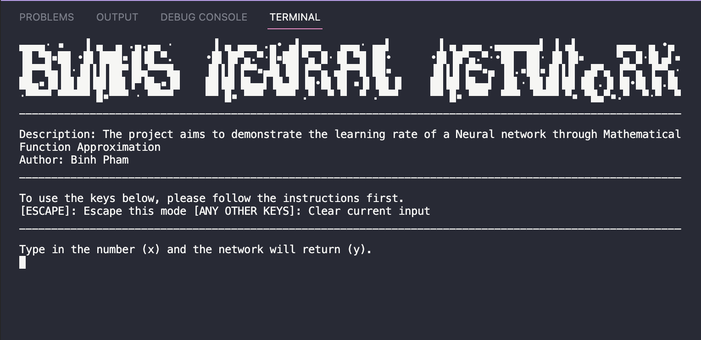
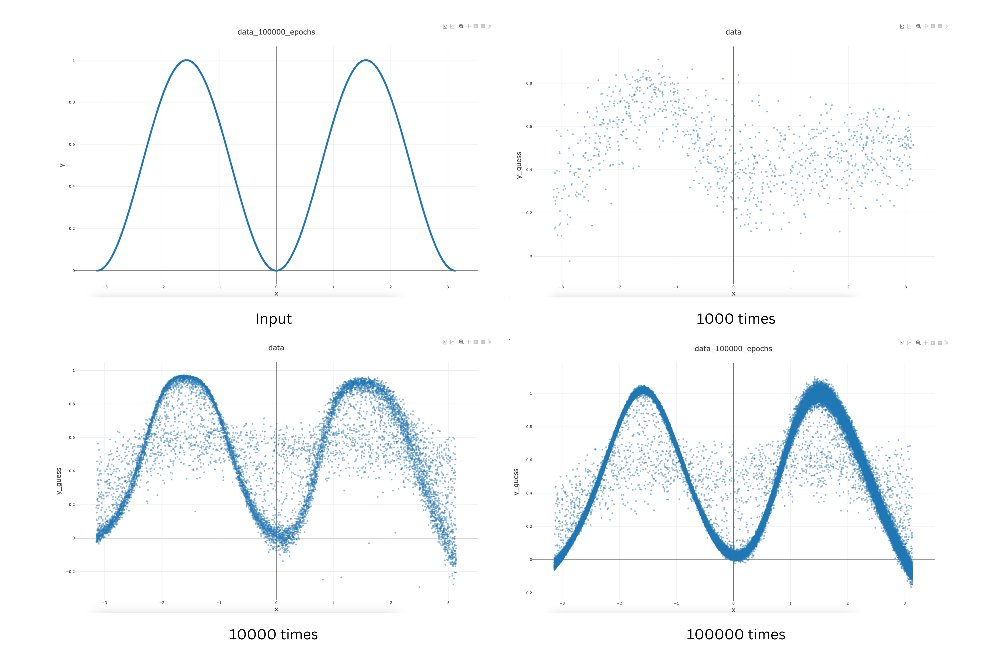
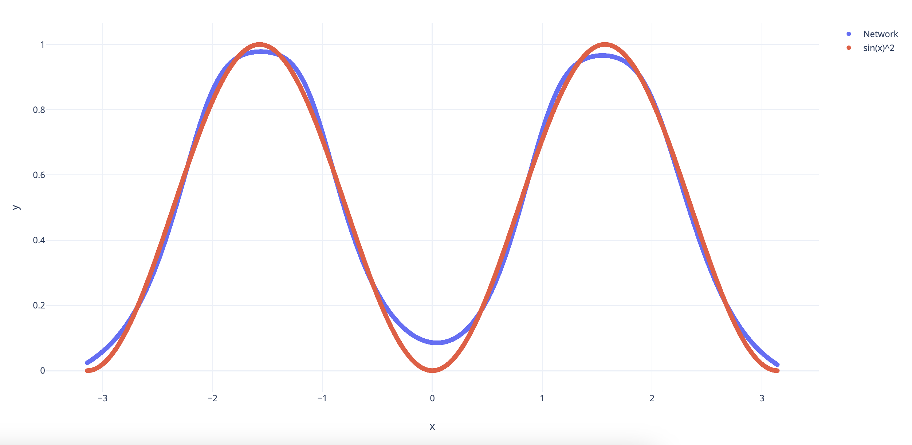
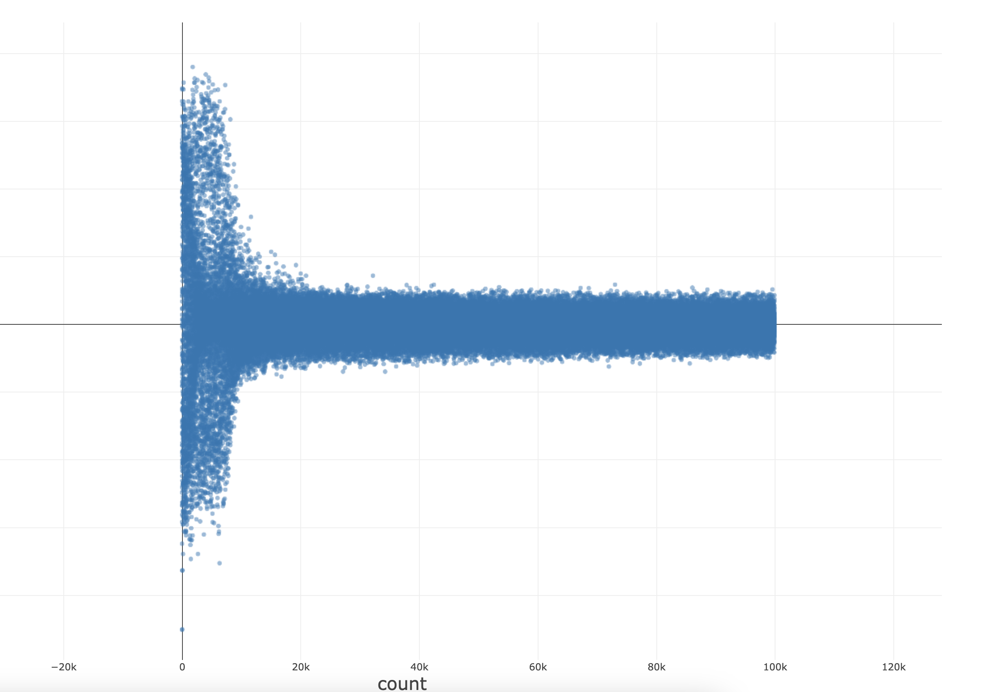

# **Binh's Neural Network** Developer Documentation

# Table Of Content

1. Introduction and Problem Statement
2. Manual
3. Solution Design and Implementation
4. Testing and Results
5. Conclusion and References

# 1. Introduction and Problem Statement

**Binh's Neural Network** is a project to demonstrate a **Neural Network** Proof Of Concept by teaching a neural network to approximate a mathematical function **y=sin(x)^2**. The project consists of three parts:

- **Matrix**: The Matrix is coded from scratch in C++ using dynamic memory allocation for doubles. This class is used to support neurons calculation like weights multiplication, bias addition.
- **Neural Network**: The Neural Network is coded from scratch in C++ using a Matrix class and a Neural Network class. This class is used to create, train and modify a neural network using matrix calculations.
- **Controller**: The Controller is coded from scratch in C++ using basic principles of a Turing's State Machine. This class is used to handle the application logic, mainly the CLI and handle user interactions with the Neural Network.

The project is built on the statement that:

- **No external library** is used except for **econio**: colored output and raw keyboard handling for Linux and Windows console in C and C++.
- Everything must be **built from the ground up**: reduce the usage of standard libraries as much as possible.
- **Accuracy** of the model can be **negligible** as long as: the model can show progress of learning.

Hence, the **most impressive** part of this project is that **it is built from scratch**.

# 2. Manual

The project was originally developed in XCode IDE on MacOS, however, it was later ported to work independently of any IDE because of incompatibilites of "econio" on XCode console. This means you can run the project **insanely straightforward** with just **a few simple commands**, if you're using MacOS or **any Linux/Unix based OS**.

```BASH
# Run these scripts in the project root
# These scripts are written by me to automate the process

# To run the project (Project must be built first)
./run.sh

# To build the project (without running it)
./build.sh

# To build the project, then run it
./build_and_run.sh
```

# 3. Solution Design and Implementation

As stated before, the project consists of three parts. These parts are build on top of eachother: **Controller > NeuralNetwork > Matrix**. We will explain from the Matrix first, then go up each class and explain how they work.

For a **brief** of the underworking **princile of the program**, the **neural network** is a **graph** consisting of **nodes and edges**, divided in layers. Each **nodes** has **inputs and outputs**, which are calculated based on weights of the input edges and the activation function. Each layer **connects in series**, therefore passing **input from one side** and **generate output** on the other side (**Forward Pass**). Using **backward propagation**, we **optimize the weights** in the network, modifying the outputs to be closer to the expected output.

The calculations of **Foward Pass** and **Backward Propagation** are carried out with **Matrix** calculations.

The **interface** of the program is based on a **State Machine**, abstracted by the **Controller** class.

This part has been mentioned earlier in my Project Selection Form.

## 3.1. Matrix

The Matrix class is the **head of the operations** in a Neural Network. We often think of **Neural Networks as a set of neurons**, but **calculation with neuron object** is a **big mess and waste of time**. That is why modern computing have special ALUs for AI/ML that are specialized in matrix calculation.

This class representation can be shown in the below diagram:


To explain how the Matrix class works, we will go through the **class declaration** of **Matrix**, as this is simple and straightfoward.

```C++
class Matrix
{
public:
    // Dimensions of the matrix
    unsigned int rows, cols;

    // Local array that stores values
    double **local_array;

    // Matrix Constructor
    // rows: rows
    // cols: cols
    // randomized: decide if value is randomized or just 0 at initialization
    Matrix(unsigned int rows = 1, unsigned int cols = 1, bool randomized = true);

    // Copy constructor
    Matrix(const Matrix &original);

    // Construct a matrix from file
    // This is created to simplify the process of saving and loading Neural Networks
    Matrix(ifstream &file);

    // Deconstructor
    // Since this class use dynamic memory, it has a destructor that destroys dynamic living being using the 5 C++ infinity stones.
    ~Matrix();

    // Basic matrix operators we learn in Linear Algebra
    Matrix &operator=(const Matrix &original);

    Matrix &operator+=(const Matrix &other);

    Matrix &operator-=(const Matrix &other);

    Matrix &operator*=(const Matrix &other);

    Matrix &operator*=(const double &a);

    Matrix transpose();

    Matrix hadamard(const Matrix &other);

    // Apply a function on all values of matrix
    void applyFunction(double (*func)(double));

    // Dynamic memory allocate/deallocate
    void allocateMemory();

    void deallocateMemory();

    // Print out the matrix
    // For debugging
    void printMatrix();

    // Save matrix to a file
    void saveMatrix(ofstream &file);

    // Other operators
    // Normally we have to have to overload member functions like the above but it made it more complicated so I stick with the non-member function
    friend Matrix operator+(const Matrix &first, const Matrix &second);
    friend Matrix operator*(const Matrix &first, const Matrix &second);
    friend Matrix operator*(const Matrix &first, const double &second);
    friend Matrix operator-(const Matrix &first, const Matrix &second);
};
```

Unlike other classes in this project, the Matrix class does **implement error handling** since it is easy to mess up matrix calculations in a neural network. For example, in the multiplication:

```C++
Matrix &Matrix::operator*=(const Matrix &other)
{
    // Error handling
    if (cols != other.rows)
    {
        throw domain_error("Matrixes can't be multiplied together: mismatch dimensions.");
    }

    Matrix temp(rows, other.cols, false);

    for (int i = 0; i < temp.rows; ++i)
    {
        for (int j = 0; j < temp.cols; ++j)
        {
            for (int k = 0; k < cols; ++k)
            {
                temp.local_array[i][j] += (local_array[i][k] * other.local_array[k][j]);
            }
        }
    }

    return (*this = temp);
}
```

This error must be caught upstream. In this project, it is caught in the main function.

```C++
try
{
    // ... we haven't come to this part yet, be patient
}
catch (domain_error e)
{
    // This will exit the program and show the error
    cout << e.what();
}
```

## 3.2. Neural Network

This class representation can be shown in the below diagram:


To explain the **Neural Network class**, we will go through the class declaration.

```C++
class NeuralNetwork
{
private:
    Topology topo;
    double learningRate;

    vector<Matrix> weights;     // store each node's weights
    vector<Matrix> biases;      // biases of each layer
    vector<Matrix> activations; // output of each layer
    vector<Matrix> errors;      // store deltas of each layer

public:
    NeuralNetwork(Topology topo, double learningRate = 0.05);
    NeuralNetwork(ifstream &file);
    ~NeuralNetwork();

    // Initialize the network, avoid code replication
    void initNetwork();

    // Foward pass the input
    void forwardPass(Matrix input);

    // Optimize the network using backwardPropagation
    void backwardPropagate(Matrix output);

    // Save network to file
    void saveNetwork(ofstream &file);

    // Train network
    Matrix train(Matrix input, Matrix output);

    // Test network
    Matrix test(Matrix input);
};
```

As you can see, the **Neural Network**, although sounds itimidating, is **actually very simple**. We will go through the functions' definitions as this is the main part of the project. Below are the main and crucial functions for the network to work.

```C++
NeuralNetwork::NeuralNetwork(Topology topo, double learningRate)
{
    this->topo = topo;
    this->learningRate = learningRate;
    initNetwork();
}

void NeuralNetwork::initNetwork()
{
    // Everything has topo - 1 size, because we don't need weights,... for the input layer
    this->weights.resize(topo.size() - 1);
    this->biases.resize(topo.size() - 1);
    this->errors.resize(topo.size() - 1);

    // Activations store the values of outputs of each node, hence the full size
    this->activations.resize(topo.size());

    // Randomize the values of weights and biases
    for (unsigned int i = 0; i < topo.size() - 1; i++)
    {
        weights[i] = Matrix(topo[i], topo[i + 1], true);
        biases[i] = Matrix(1, topo[i + 1], true);
    }
}

void NeuralNetwork::forwardPass(Matrix input)
{
    // Set input to activation
    activations[0] = input;

    // Pass through the whole network
    for (unsigned int i = 0; i < topo.size() - 1; i++)
    {
        // Initial values by multiplying inputs with weights matrix
        Matrix dot = activations[i] * weights[i];

        // Add the biases
        Matrix hidden = dot + biases[i];

        // Activate the outputs (to introduce non-linear)
        hidden.applyFunction(activate);

        // Save the outputs
        activations[i + 1] = hidden;
    }
}

void NeuralNetwork::backwardPropagate(Matrix output)
{
    // Calculate the deltas
    errors[topo.size() - 2] = activations[topo.size() - 1] - output;

    // Backward traverse the network
    for (unsigned int i = topo.size() - 2; i > 0; i--)
    {
        // This part is totally from
        // Matt Mazur's mathematical model: https://mattmazur.com/2015/03/17/a-step-by-step-backpropagation-example/
        // Basically, we generate a gradient of errors based on the speed of change of outputs based on the change of weights (or d(act)/d(weights))
        // Then we apply the errors bach to the weights in proportion with the learning rate

        Matrix dot = errors[i] * weights[i].transpose();

        // Since we saved the activated values in activate, we need to deriv it back to calculate the errors.
        Matrix cache = activations[i];
        cache.applyFunction(activateDerivative);
        Matrix derivative = cache;

        // Formula from Matt Mazur's
        errors[i - 1] = dot.dotMultiply(derivative);
    }

    // Update the values
    // If we know how much an output change if we change the weights
    // We can update the weights so that the output match perfectly with the desired output
    // We use learningRate to control how much we want it to match
    for (unsigned int i = 0; i < topo.size() - 1; i++)
    {
        Matrix delta = activations[i].transpose() * errors[i];
        weights[i] = weights[i] - (delta * learningRate);
        biases[i] = biases[i] - (errors[i] * learningRate);
    }

    return;
}

Matrix NeuralNetwork::test(Matrix input)
{
    // To test the network, we just need to foward pass the input
    forwardPass(input);

    // The last layer of activations is the values we need
    // Remember from the foward pass
    return activations[topo.size() - 1];
}

Matrix NeuralNetwork::train(Matrix input, Matrix output)
{
    // To train the network, we foward pass the input, therefore getting the predictions of the output
    forwardPass(input);

    // Then we can calculate the deltas between predictions and expected
    // Backward propagte and we know how much to change the weights based on the learning rates
    backwardPropagate(output);

    return activations[topo.size() - 1];
}
```

Along with the functions of the network, there are also the helper functions. These functions are activation functions and is used to introduce non-linearity to the system of equations used by the network. As you can see, if there is no activation function, the whole network is just a big set of equations.

```C++
inline double activate(double x)
{
    return tanh(x);
}

inline double activateDerivative(double x)
{
    return 1 - x * x;
}
```

To visualize the network, below is a saved file of a Neural Network generated by the program. In there, you can see the topology, weights and biases of the network. This network has 4 layers with 2 hidden layers of size 3 and 4 respectively.

```BASH
# Size of topo, learning rate
4 0.05

# Topo in-depth
1 3 4 1

# Weights
1 3
-0.473773 -1.011 1.07464
3 4
1.1071 -1.02039 -0.894242 0.0607395
-0.147152 -0.185371 -0.184267 1.20092
0.265926 -0.309461 -0.280002 -0.834268
4 1
-0.56776
0.84127
0.784303
0.883332

# Biases
1 3
-0.774578 -1.16094 0.864748
1 4
0.811376 0.0179418 0.582895 0.12337
1 1
0.286879
```

You can save the network like this (without the comments) by choosing to save the network in the program. The save file can be found under the /data/ dir in the project root. It is called **"network.txt"**.

When you **load the network from file**, **this file is also selected**.

In this part, I want to note that the Neural Network **can't be done** without the help of [**Matt Mazur's Mathematical Model**](https://mattmazur.com/2015/03/17/a-step-by-step-backpropagation-example/). In this article, he showed us how to **calculate the error derivation** which is the base of **Backward Propagation**.

## 3.3 Controller

Although the project is about AI/ML, the hardest and most interesting part to me is the **Controller**. At the end of BOP1, we learned about **State Machine** and I thought to myself it would be wonderful to use the **State Machine** in an User Interface.

The **Controller** is an implementation of **Turing's State Machine** in C++. It **captures user inputs** using **econio** and the **default C++ iostream**. These inputs **change the internal state** of the controller, prompt it to **change the outputs of the display**.

To symbolize the states, it uses an **enum** called **StateNumber**. This stores the **index** for the **transition table** in the State Machine. The **transition table** is an array that stores function at the index symbolized by the enum.

**Each function** renders the output to the user and they can change the states of the machine.



The class declartion below will help you understand how the class is implemented:

```C++

// To have readability, we use enums to represent the states
enum StateNumber
{
    GEN_MENU = 0,
    // Phase 1
    CREATE = 1,
    LOAD = 2,

    // Phase 2
    CONTROL_MENU = 3,
    TRAIN = 4,
    TEST = 5,
    SAVE = 6,
    EXIT = 7
};

class Controller
{
private:
    // internal neural network
    NeuralNetwork* n;

    // Current state of network
    StateNumber currentState;

    // If you use the program, you will see that we have a radio menu controller by arrow keys
    // This is to store where the cursor is pointing in the menu
    int currentCursorPosition;

    // Defining void(void) function as Action function
    typedef void (Controller::*Action)();

    // State transitions function
    void printBanner();
    void generationMenu();
    void controlMenu();
    void createNetwork();
    void trainNetwork();
    void testNetwork();
    void loadNetwork();
    void saveNetwork();
    void exit();

    // State Transitions array
    Action stateTransitions[8];

public:
    // Render flag to signal the system
    bool renderFlag;

    Controller()
    {
        // Storing functions in arrays
        stateTransitions[GEN_MENU] = &Controller::generationMenu;

        // Phase 1
        stateTransitions[CREATE] = &Controller::createNetwork;
        stateTransitions[LOAD] = &Controller::loadNetwork;

        // Phase 2
        stateTransitions[CONTROL_MENU] = &Controller::controlMenu;
        stateTransitions[TRAIN] = &Controller::trainNetwork;
        stateTransitions[TEST] = &Controller::testNetwork;
        stateTransitions[SAVE] = &Controller::saveNetwork;
        stateTransitions[EXIT] = &Controller::exit;

        // Set initial values
        currentState = GEN_MENU;
        currentCursorPosition = 0;
        renderFlag = true;
    };

    ~Controller()
    {
        delete n;
    };


    void render();
};
```

This class representation can be shown in the below diagram:


Using the State Machine, the **render()** function can be minimized and is more readable. The whole system is also modular because of this.

```C++
void Controller::render()
{
    // We need to make sure if we have gotten out of econio rawmode
    // As you know, raw mode block the program from executing
    econio_normalmode();

    // Clear the screen
    econio_clrscr();

    // Print the banner
    printBanner();

    // Execute the state transition
    (this->*stateTransitions[currentState])();
    return;
}
```

We will go through an **easy example** of a **state transition function** below.

```C++
void Controller::testNetwork()
{
    // Basic output
    cout << "To use the keys below, please follow the instructions first." << endl;
    cout << "[ESCAPE]: Escape this mode [ANY OTHER KEYS]: Clear current input" << endl;
    cout << "_______________________________________________________________________________________________________" << endl
         << endl;

    // Conditional Error Message
    if (cin.good())
    {
        cout << "Type in the number (x) and the network will return (y)." << endl;
    }
    else
    {
        // Color setting
        econio_textcolor(COL_RED);
        econio_textbackground(COL_WHITE);

        cout << "Error: [Please enter DOUBLE]" << endl;

        econio_textbackground(COL_RESET);
        econio_textcolor(COL_RESET);
        cout << "Type in the number (x) and the network will return (y)." << endl;
    }

    // Flush cin
    cin.clear();

    Matrix x = Matrix(1, 1);
    Matrix y_guess = Matrix(1, 1);

    cin >> x.local_array[0][0];

    // Error checking
    // If error found, reset this stage
    if (!cin.good())
    {
        return;
    }

    // Get the predicted result
    y_guess = n->test(x);

    // Output the result
    cout << "Network result: " << y_guess.local_array[0][0] << " Expected result: " << sin(x.local_array[0][0]) * sin(x.local_array[0][0]) << endl;

    // Wait for user next command
    econio_rawmode();
    int key = econio_getch();
    if (key == KEY_ESCAPE)
    {
        currentState = CONTROL_MENU;
    }

    // After this transition, if the user doesn't escape, it is going to loop itself again.
    // We will learn how next
}
```

As you can see from the comments and from using the program, we can see that **the function is going to loop itself**. But **how?** That is because of a **nice thing with State Machine**, if we **don't change the state**, it is going to **loop the same state over and over**.



This is the pure reason **why I love computer science**.

# 4. Testing and Results

Next up, we review the best part of this project, does the Neural Network actually works?

## 4.1. Testing the program

**The program's instructions** are **very straightfoward**. In **each window**, there are **instructions of what you should do**, so a step-by-step guide **will not be covered in the developers document**.



I ensure that **each function of the project has been inspected carefully be me**, so there is **no memory leak or any potential error**. The most crucial part of the program is also **protected with error handling**. If any error occur, the program will stop immediatly with error's description.

For input fields, if you **enter invalid data types**, such as a string where a int would be, the program will prompt you to **re-enter everything again**.

### 4.1.1 Structure of Files

The program's artifacts are generated in **/data** directory. This directory includes 3 files:

- **network.txt**: Store Pre-trained network data that you can load or save into.
- **data.csv**: Store training data of the network.
- **test.csv**: Store test data of the network (always contain 10000 data points).

Data structure are of the following (**in data.txt and test.txt**):
| count | x | y | y_guess | loss |
| - | - | - | - | - |
| Index of data | Input | Expected output | Output of network | Delta of Output (y_guess - y) |

## 4.2. Results of Neural Network

The testing setup is simple. We will create a Neural Network with **2 hidden layers**, with the following size: **3 and 4**. From this, we will train the network gradually with the following epochs: **1000, 10000 and 100000**. At **each training session**, the program **automatically saves the "data.csv"** and we use this file to **compare the accuracy** between each test.

_As given previously, we can create a network or load it from file. If you want to have a pretrained network, please use the setup mentioned in #3.2 and paste it into "network.txt" in /data/ directory._



As you can see, there are clear improvements of the network. From barely having any resembalance of the function, we can clearly see the curves.

**\*Since this is training data, not test data, there are noise from previous iterations.**

Apart from the **"data.csv"**, the network also generate a file called **"test.csv"** at the end of each iteration. This file is a **test dataset with 10000 data points** and the network doesn's improve itself when generating these date points. Using this file, we can see the true performance of the network without any noise.



Furthermore, by using **count** and **loss** of **"data.csv"**, we can see how the loss function or accuracy of the network improve in real time.



If I can say one word, insaneeeeeeeeeee!!!!!!!

## 4.3. Performance of Neural Network

This **Neural Network** is the **purest form of AI** there is, except for if/else AI. Because **it is written from scratch**, the **performance** can be **higher** than any AI/ML that was developed with libraries and frameworks in Python or even C++.

I have not tested this theory, however, if you use the program, you will see that **100000 epochs only cost us around 1sec to train**. This was tested on a Macbook Pro with M1 Pro and 32Gb of Ram.

Potential upgrades of this Neural Network could be using different Matrix libraries that supports hardware acceleration. However, this is **out of scope for the project**. I'm only including this part because the reader might be a geek like me.

# 5. Conclusion and References

# 5.1 Conclusion

**Thank you for reading this documentation**. I really appreciate this.

This project was insanely fun for me and I learned a lot through doing this.

For people who read this document carefully, I have included some easter eggs in the comments of the code in this document. Please find the **5 C++ infinity stones**.

# 5.2 References

The project couldn't be done without the resources of:

- **Matt Mazur**: https://mattmazur.com/2015/03/17/a-step-by-step-backpropagation-example/
- **Lyndon Duong**: https://www.lyndonduong.com/mlp-build-cpp/
- **GeekForGeeks Writer**: https://www.geeksforgeeks.org/ml-neural-network-implementation-in-c-from-scratch/
- **czirkoszoltan**: https://github.com/czirkoszoltan/c-econio
